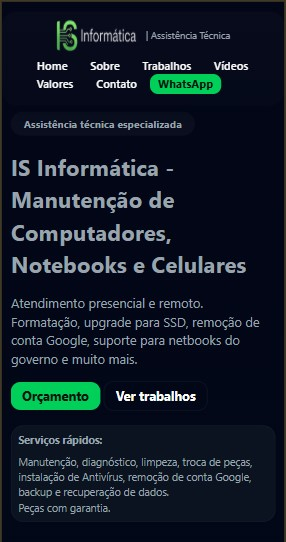
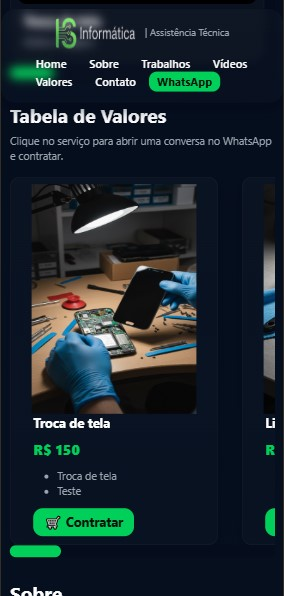

# 📱 IS Informática – Assistência Técnica

Site institucional desenvolvido em **HTML, CSS e JavaScript**, seguindo a abordagem **Mobile First**.  
O objetivo é apresentar serviços, valores, trabalhos realizados e facilitar o contato com clientes via **WhatsApp** e **Instagram**.

---

## 🚀 Sobre o Projeto

Este projeto foi criado como uma página institucional para uma loja de Assistência Técnica de Computadores, Notebooks e Celulares.

O layout foi planejado inicialmente para **dispositivos móveis**, garantindo performance, legibilidade e usabilidade.  
Posteriormente, serão implementadas versões específicas para **tablet, notebook e desktop**.

---

## 📌 Funcionalidades

### ✔️ Mobile First
- Todo o layout foi projetado primeiramente para telas pequenas.
- Media queries já preparadas para expansão:
  - 600px  
  - 768px  
  - 1024px  
  - 1280px  
  - 1536px  

### ✔️ Navegação suave
- Links âncora usando **scrollIntoView()**.

### ✔️ Menu moderno
- Header com efeito **glassmorphism** (blur + transparência).
- Botão CTA fixo para **WhatsApp**.

### ✔️ Seção Hero
- Texto chamativo com serviços principais.
- Vídeo demonstrativo responsivo.

### ✔️ Galeria de Fotos
- Grid responsivo exibindo serviços realizados.

### ✔️ Seção de Vídeos
- Carrossel horizontal com vídeos de manutenções.

### ✔️ Tabela de Valores
- Cards com:
  - Preço  
  - Descrição  
  - Botão para contratar via WhatsApp  

### ✔️ Sobre
- Missão e visão da empresa.

### ✔️ Contato
- **WhatsApp** clicável  
- **Instagram** clicável  

### ✔️ Depoimentos
- Cards com feedbacks de clientes.

### ✔️ Footer Automático
- Ano atualizado via JavaScript.

### ✔️ Fallback para imagens ausentes
- Substitui imagens quebradas por um **placeholder SVG**.

---

## 🛠 Tecnologias Utilizadas

### **Frontend**
- HTML5  
- CSS3  
- Variáveis CSS (:root)  
- Flexbox  
- Grid  
- Responsividade (Mobile First)  
- Scroll customizado  
- Glassmorphism  
- JavaScript Vanilla  
- Smooth Scroll  
- Fallback de imagens  

### **Design / UI**
- Tema escuro moderno  
- Cards reutilizáveis  
- Layout limpo e profissional  

---

## 📂 Estrutura do Projeto
```
/
├── index.html
├── style.css
├── global.css
├── assets/
│ ├── img/
│ └── videos/
└── README.md
```

---

## 📸 Prévia das Seções

- Header com logo + menu  
- Hero com chamada e vídeo  
- Galeria de Fotos  
- Vídeos com scroll horizontal  
- Tabela de Preços  
- Sobre (missão e visão)  
- Contato  
- Depoimentos  
- Footer automático  

> 
> 

---

## 📱 Responsividade

Media queries utilizadas:

```css
@media (min-width: 600px) { }
@media (min-width: 768px) { }
@media (min-width: 1024px) { }
@media (min-width: 1280px) { }
@media (min-width: 1536px) { }

```
## 📁 Como visualizar o projeto

Você pode:

1. Clonar este repositório:
```bash
git clone https://github.com/Isa-Silva/IS-Informatica.git
```
2. Abrir o Git Pages:
```bash
islania-silva.github.io/IS-Informatica/
```

📝 Licença
Projeto de uso pessoal/estudo.
Você pode modificar livremente para seus próprios fins.

🙋‍♀️ Autor
IS Informática – Assistência Técnica
Criado com foco em agilidade, transparência e profissionalismo no atendimento.